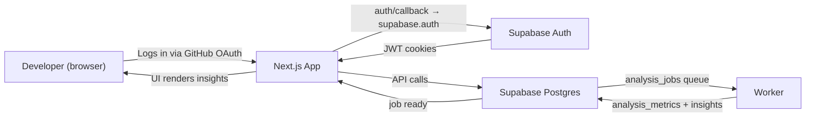
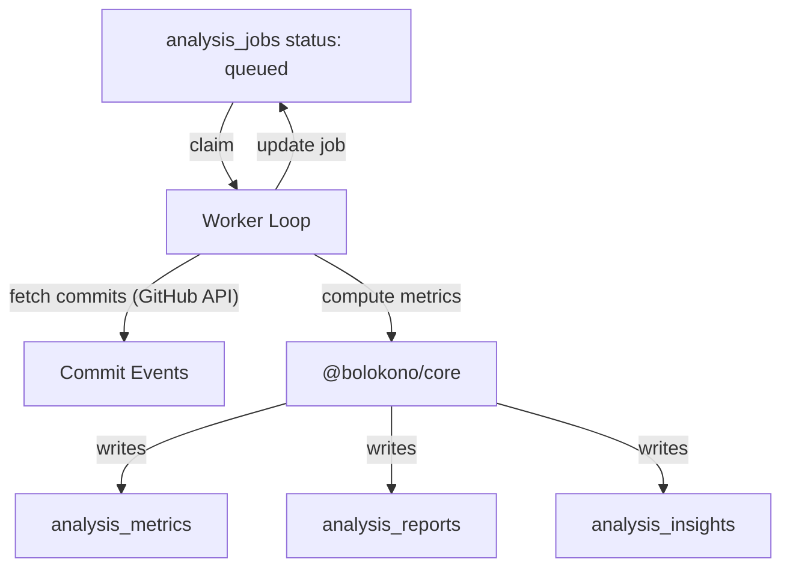

# Bolokono Architecture Overview

This document explains how the Bolokono stack fits together, how data flows from a logged-in user through Supabase, the worker, and the UI, and which pieces of the codebase (web, worker, packages) own each responsibility. The diagrams use Mermaid syntax so you can paste them into any renderer, but the textual explanations also narrate every interaction.

## High-level Components

1. **Next.js 16 (App Router) Web App** (`apps/web`)
   - Hosts the public marketing homepage (`/`) plus authenticated areas (`/repos`, `/analysis/[jobId]`, `/login`, `/auth/callback`, etc.).
   - Handles Supabase Auth via `proxy.ts`, guarding protected routes and synchronizing auth cookies.
   - Calls Supabase Route Handlers (`/api/analysis/*`, `/api/github/sync-repos`, etc.) to start jobs, list repos, fetch shared insights, export share cards, and run other backend flows.
   - Renders the “Vibed” experience by reading `analysis_insights`, `analysis_metrics`, `analysis_reports`, and job metadata into interactive and shareable dashboards.

2. **Supabase Backend (Postgres + Auth + Edge)** (`supabase`)
   - Stores all domain data in tables such as `users`, `repos`, `analysis_jobs`, `analysis_metrics`, `analysis_reports`, `analysis_insights`, `github_accounts`, etc. The `supabase` folder tracks migrations and seeds.
   - Enforces row-level security so each user only sees their records; Supabase Auth is the entrypoint for GitHub OAuth (handled in the Next app via the `/auth/callback` route).
   - Provides RPCs such as `claim_analysis_job` to coordinate workers.

3. **Bolokono Worker** (`apps/worker`)
   - Polls `analysis_jobs` (via `claim_analysis_job` RPC) and processes each job sequentially.
   - Fetches commits through the GitHub API, decrypts stored tokens, calculates metrics with `@bolokono/core`, assigns a Bolokono persona, and writes structured results back to Postgres (`analysis_metrics`, `analysis_reports`, `analysis_insights`, updates job status).
   - Hosts a health endpoint so orchestration (e.g., Docker Compose, Supervisord, or manual runs) can monitor liveness.

4. **Shared Libraries**
   - `packages/core`: Analysis logic (metrics, persona assignment, insights computation). Called from the worker and also re-used by front-end logic that needs to rehydrate data.
   - `packages/db`: Supabase client helpers, database type definitions, and utilities such as `createServerClient`.

## User-to-Database Flow

1. **Authentication**: The Next.js app routes users to Supabase Auth for GitHub OAuth, then stores cookies so the `proxy` can guard routes.
2. **Job orchestration**: When a user requests analysis, the app inserts a row into `analysis_jobs`. The worker claims it via RPC and transitions `status` from `queued` → `running` → `done`.
3. **Results persistence**: Metrics, narratives, and persona insights are stored separately:
   - `analysis_metrics.events_json` + `metrics_json`
   - `analysis_reports.narrative_json` + `matched_criteria`
   - `analysis_insights.insights_json`, `tech_signals`, `persona_*`, `share_template`, `persona_delta`, `sources`
   This separation keeps raw data, narrative, and share assets decoupled.

## Worker Pipeline Diagram

- **Polling**: The worker polls Postgres every `POLL_INTERVAL_MS` (5 s) and claims jobs via `claim_analysis_job`.
- **Commit retrieval**: It uses the GitHub token (stored encrypted in `github_accounts`) to fetch the most recent commit list and details.
- **Computation**: `computeAnalysisMetrics`, `assignBolokonoType`, and `computeAnalysisInsights` generate the numbers, persona, tech signals, share template, and confidence data.
- **Persistence**: Each result writes to a dedicated table, ensuring the UI can render both “Vibed summary cards” and “Deep dive evidence” without recompute.

## API & UI Interaction Map

1. `/api/repos/connect` – Redirects to GitHub OAuth flow (backend).
2. `/api/github/sync-repos` – Syncs repositories after OAuth (exports to `repos` table).
3. `/api/analysis/start` – Inserts new `analysis_jobs`.
4. `/api/analysis/history` – Lists past jobs (drives persona evolution views).
5. `/api/analysis/[jobId]/share` – Renders share-card exports (PNG/SVG) using `share_template` colors and text from `analysis_insights`.
6. `/analysis/[jobId]` – Next.js page that reads `analysis_insights`, `analysis_metrics`, and `analysis_reports` to build the “Vibed” experience with highlights and deep dives.

## Historical Persona Tracking

Each `analysis_insights` row stores:

| Column | Purpose |
| --- | --- |
| `persona_id`, `persona_label`, `persona_confidence` | Stable identifier + label to show persona per job. |
| `share_template` | Theme colors/text for share card export. |
| `persona_delta` | Signals how persona changed vs. previous job (e.g., `status: “evolved to collaborative architect”`). |
| `sources` | Evidence used to justify insights (commit IDs, heuristics). |

Combined with the `/api/analysis/history` endpoint, the UI can plot persona evolution over time, showing “Your vibe changed from Vibe Prototyper to Pragmatic Augmenter after 14 jobs”.

## Deployment & Environment Notes

- **Ports**: Next.js runs on `NODE_PORT` 8108 by default (`npm run dev:web`). Worker exposes a health server on `WORKER_PORT` (default 8109).
- **Environment variables**:
  - `NEXT_PUBLIC_SUPABASE_URL`, `NEXT_PUBLIC_SUPABASE_ANON_KEY`, `SUPABASE_SERVICE_ROLE_KEY`
  - `GITHUB_CLIENT_ID`, `GITHUB_CLIENT_SECRET`, `GITHUB_TOKEN_ENCRYPTION_KEY`
  - `ANTHROPIC_API_KEY` (if narrative generation later)
- **Dev workflow**: Use `npm run type-check`, `npm run lint`, `npm run test?` (if available) + `npm run build`.

## Bringing It Together

- **Frontend**: Next.js renders both marketing copy and the authenticated “Vibed” dashboard. It relies on shared data structures from `packages/db`.
- **Backend**: Supabase stores user, repo, job, metric, report, and insight data; the worker writer uses `packages/core` to derive AI-assisted personas and insights and writes them back.
- **UX interplay**: The UI reads from the same insights JSON the worker produces, which means the data rendering layer is deterministic and traceable (the worker is the single source of truth for persona claims).

Future architecture work can expand the diagrams (e.g., add mobile clients, third-party exports, or agentic analysis). This overview captures the current end-to-end flow and how the major repositories interact.
