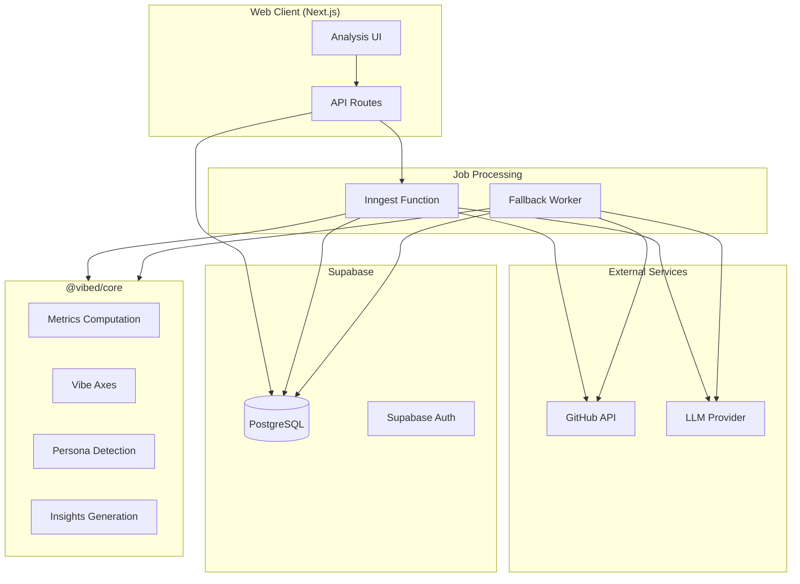
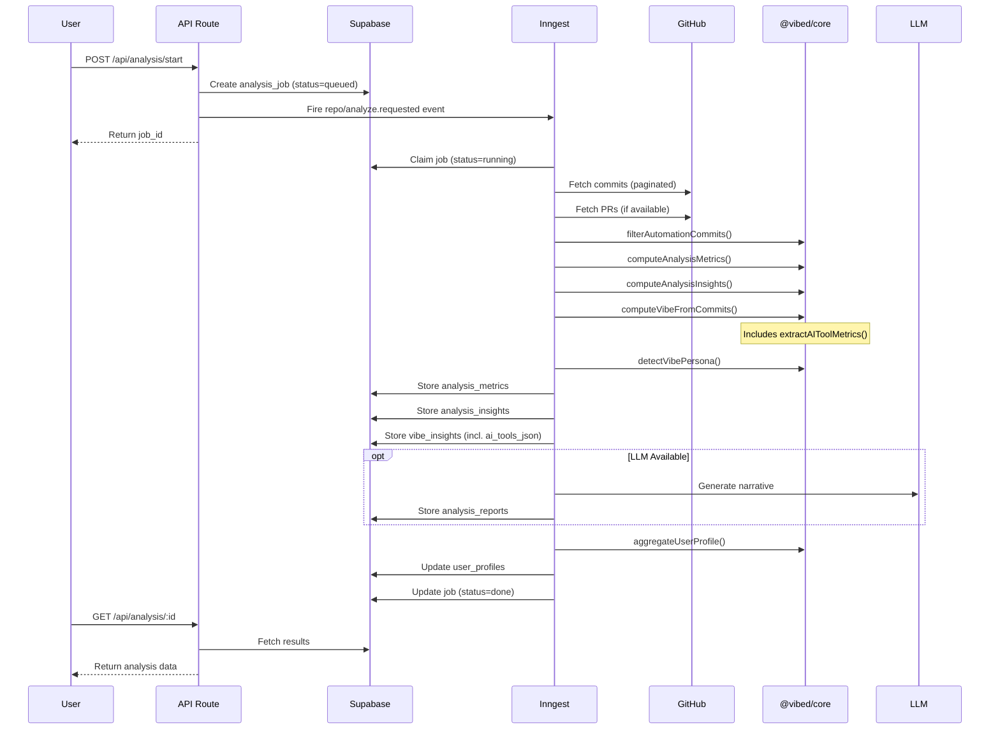
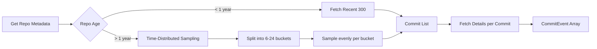
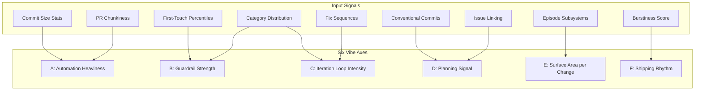
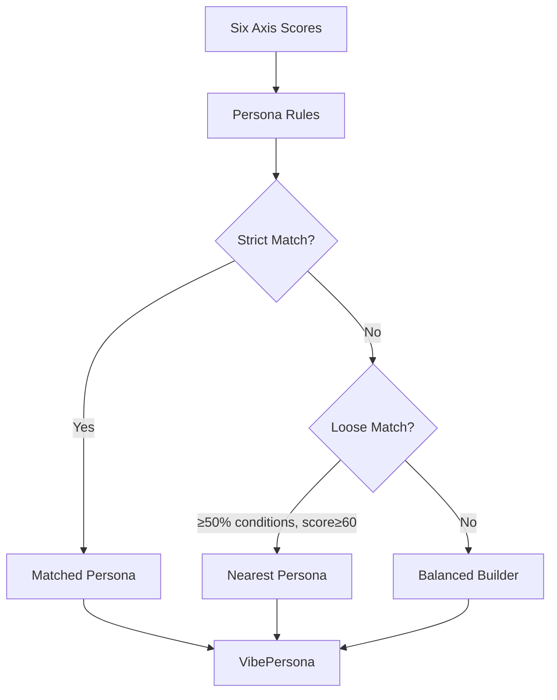
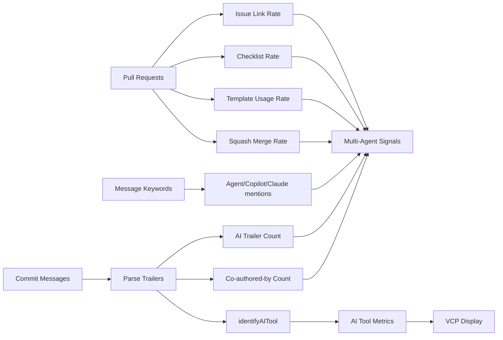
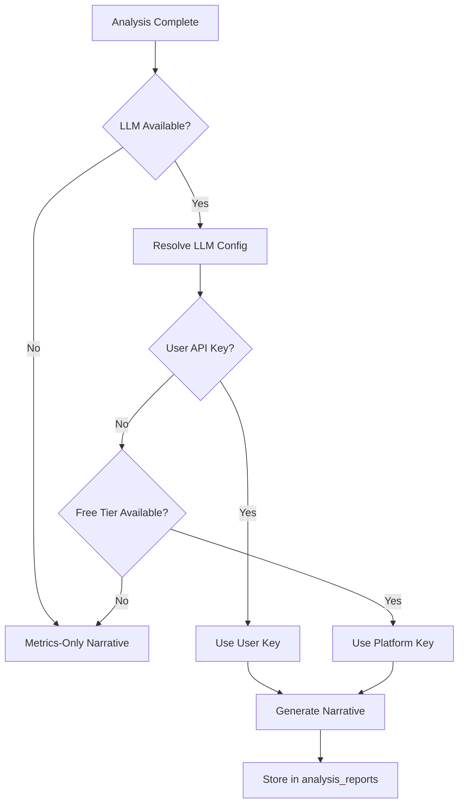
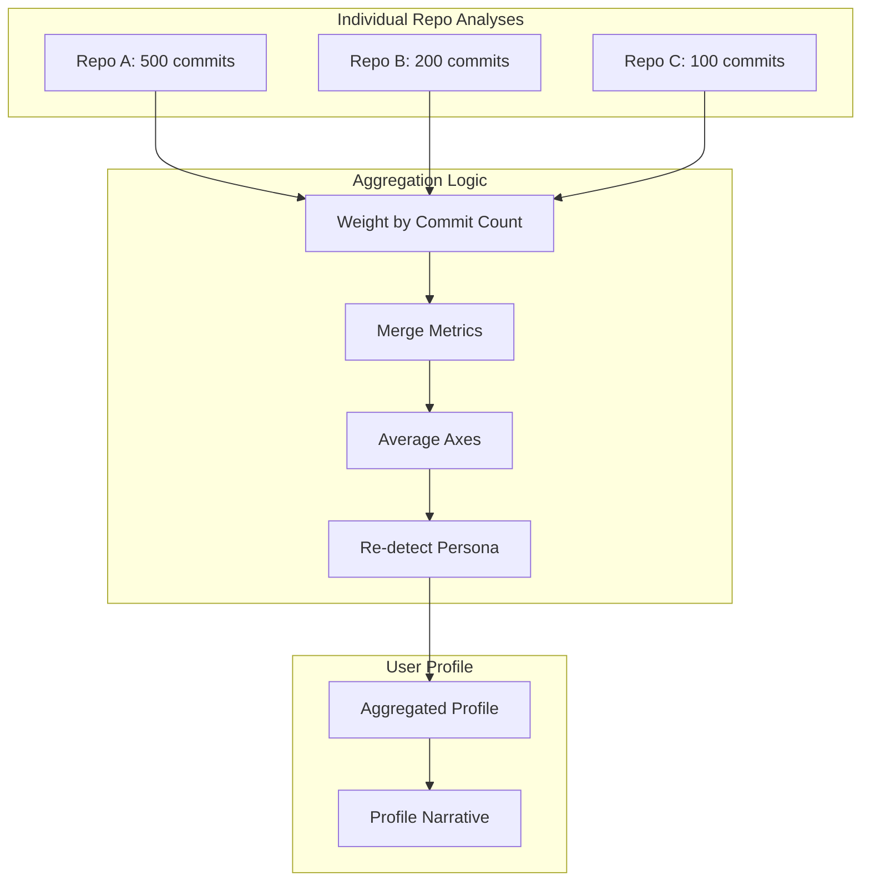
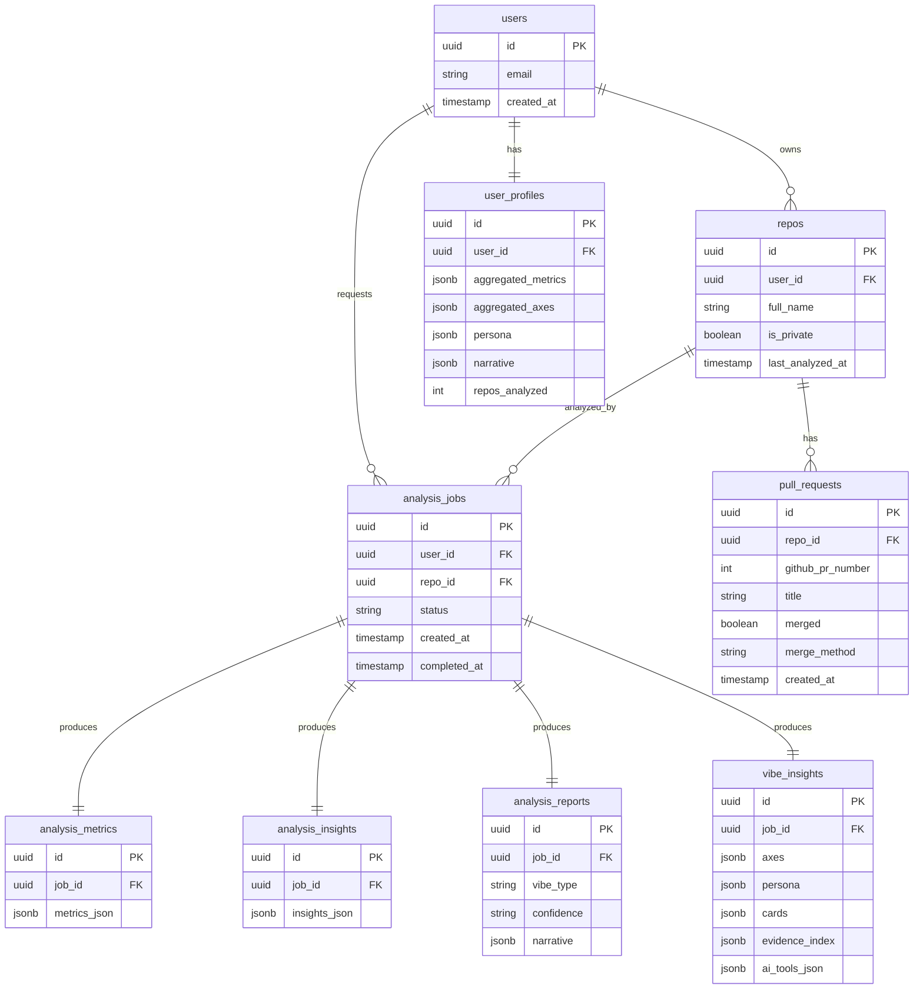

# Vibe Coding Profile Analysis Pipeline — Technical Architecture

> **Last Updated:** January 2026  
> **Maintainer:** Update this document when analysis logic, data models, or algorithms change.

This document provides a comprehensive technical reference for how Vibe Coding Profile analyzes repositories and generates Repo VCPs and Unified VCPs. It covers data flow, algorithms, type definitions, and links to source code.

---

## Table of Contents

1. [High-Level Architecture](#high-level-architecture)
2. [Data Flow](#data-flow)
3. [Repository Analysis Pipeline](#repository-analysis-pipeline)
4. [Metrics Computation](#metrics-computation)
5. [Vibe Axes System](#vibe-axes-system)
6. [Persona Detection](#persona-detection)
7. [Insights Generation](#insights-generation)
8. [LLM Narrative Generation](#llm-narrative-generation)
9. [Profile Aggregation](#profile-aggregation)
10. [Database Schema](#database-schema)
11. [Source Code References](#source-code-references)

---

## High-Level Architecture



### Components

| Component | Location | Responsibility |
|-----------|----------|----------------|
| Web Client | `apps/web` | UI, API routes, job triggering |
| Inngest Function | `apps/web/src/inngest/functions/analyze-repo.ts` | Primary job processor |
| Fallback Worker | `apps/worker/src/index.ts` | Self-hosted fallback |
| @vibed/core | `packages/core/src/` | All analysis logic |
| Database | `supabase/migrations/` | Persistent storage |

---

## Data Flow



---

## Repository Analysis Pipeline

### Step 1: Job Creation

```typescript
// API creates job record
interface AnalysisJob {
  id: string;
  user_id: string;
  repo_id: string;
  status: "queued" | "running" | "done" | "error";
  created_at: string;
  started_at: string | null;
  completed_at: string | null;
  error_message: string | null;
}
```

### Step 2: Commit Fetching



**Sampling Strategy:**
- Repos are divided into time buckets (6-24 based on size)
- Each bucket is sampled evenly to capture patterns across the repo's lifetime
- Maximum 300 commits per analysis
- Commit details (file paths, stats) fetched in parallel batches

### Step 3: Automation Filtering

```typescript
// packages/core/src/index.ts
function isAutomationCommit(event: CommitEvent): boolean {
  // Filters: dependabot, renovate, release-please, github-actions, etc.
  // Based on email patterns and commit message patterns
}

function filterAutomationCommits(events: CommitEvent[]): CommitEvent[]
```

**Filtered Patterns:**
- Bot emails: `dependabot`, `renovate`, `github-actions`, `[bot]`
- Message patterns: `chore(release):`, `bump version`, `[automated]`

---

## Metrics Computation

### Input Type

```typescript
interface CommitEvent {
  sha: string;
  message: string;
  author_date: string;
  committer_date: string;
  author_email: string;
  files_changed: number;
  additions: number;
  deletions: number;
  parents: string[];
  file_paths?: string[];  // For subsystem detection
}
```

### Output Type

```typescript
interface AnalysisMetrics {
  // Volume
  total_commits: number;
  total_additions: number;
  total_deletions: number;
  total_files_changed: number;

  // Timing
  first_commit_date: string;
  last_commit_date: string;
  active_days: number;
  span_days: number;

  // Commit Size Distribution
  commit_size_p50: number;
  commit_size_p90: number;
  commit_size_mean: number;
  commit_size_stddev: number;

  // Frequency
  commits_per_active_day_mean: number;
  commits_per_active_day_max: number;

  // Rhythm
  hours_between_commits_p50: number;
  hours_between_commits_p90: number;
  burstiness_score: number;  // -1 (steady) to +1 (bursty)

  // Message Analysis
  message_length_p50: number;
  message_length_p90: number;
  conventional_commit_ratio: number;

  // Iteration Patterns
  fix_commit_ratio: number;
  fixup_sequence_count: number;  // fix-after-feature sequences

  // Build Sequence
  category_first_occurrence: Record<BuildCategory, number>;
  category_distribution: Record<BuildCategory, number>;

  // Merge Behavior
  merge_commit_ratio: number;

  // Confidence
  data_quality_score: number;  // 0-100
}
```

### Build Category Classification

```typescript
type BuildCategory =
  | "setup" | "auth" | "feature" | "test" | "infra"
  | "docs" | "refactor" | "fix" | "style" | "chore" | "unknown";

function classifyCommit(message: string): BuildCategory {
  // Priority 1: Conventional commit prefixes (feat:, fix:, test:, etc.)
  // Priority 2: Scope overrides (auth, setup)
  // Priority 3: Keyword matching
  // Priority 4: Default to "feature" for substantive commits
}
```

### Burstiness Score Algorithm

```typescript
function calculateBurstiness(timestamps: Date[]): number {
  // Burstiness = (stddev - mean) / (stddev + mean)
  // Range: -1 (perfectly regular) to +1 (highly bursty)
  const intervals = timestamps.map((t, i) => 
    i > 0 ? (t - timestamps[i-1]) / (1000 * 60 * 60) : 0
  ).slice(1);
  
  const mean = avg(intervals);
  const stddev = std(intervals);
  return (stddev - mean) / (stddev + mean);
}
```

---

## Vibe Axes System

Six deterministic axes scored 0-100:



### Axis Computation

```typescript
interface AxisValue {
  score: number;      // 0-100
  level: "low" | "medium" | "high";
  why: string[];      // Evidence IDs
}

interface VibeAxes {
  automation_heaviness: AxisValue;
  guardrail_strength: AxisValue;
  iteration_loop_intensity: AxisValue;
  planning_signal: AxisValue;
  surface_area_per_change: AxisValue;
  shipping_rhythm: AxisValue;
}
```

### Axis A: Automation Heaviness

**Signals:**
- Average files changed per commit
- p90 commit size (additions + deletions)
- p90 PR changed files

**Formula:**
```
Score = 0.5 × scoreFromZ(avgFiles, mid=4, spread=4)
      + 0.3 × scoreFromZ(p90Commit, mid=400, spread=400)
      + 0.2 × scoreFromZ(prP90, mid=25, spread=25)
```

### Axis B: Guardrail Strength

**Signals:**
- First-touch percentile for tests/CI/docs (earlier = stronger)
- Guardrail commit density (tests + docs + chore + CI)
- PR checklist presence rate

**Formula:**
```
Score = 0.5 × (1 - avgFirstTouch) × 100
      + 0.3 × guardrailDensity × 200
      + 0.2 × prChecklistRate × 100
```

### Axis C: Iteration Loop Intensity

**Signals:**
- Fix-after-feature sequence count
- Fix commit ratio
- Episode fix density

**Formula:**
```
Score = 0.5 × scoreFromZ(fixSeq/total, mid=0.12, spread=0.12)
      + 0.3 × fixRatio × 100
      + 0.2 × episodeFixDensity × 100
```

### Axis D: Planning Signal

**Signals:**
- Conventional commit ratio
- PR issue linking rate
- Docs-before-feature pattern

**Formula:**
```
Score = 0.35 × issueLinkRate × 100
      + 0.35 × conventionalRatio × 100
      + 0.30 × docsFirst × 100
```

### Axis E: Surface Area per Change

**Signals:**
- Median subsystems touched per work episode

**Formula:**
```
Score = scoreFromZ(medianSubsystems, mid=3, spread=2)
```

### Axis F: Shipping Rhythm

**Signals:**
- Burstiness score
- p90 commits per episode

**Formula:**
```
Score = 0.6 × ((burstiness + 1) / 2) × 100
      + 0.4 × scoreFromZ(episodeP90, mid=6, spread=6)
```

---

## Persona Detection



### Persona Rules

```typescript
type VibePersonaId =
  | "prompt_sprinter"      // Vibe Prototyper
  | "guardrailed_viber"    // Test-First Validator
  | "spec_first_director"  // Spec-Driven Architect
  | "vertical_slice_shipper" // Agent Orchestrator
  | "fix_loop_hacker"      // Hands-On Debugger
  | "rapid_risk_taker"     // Rapid Risk-Taker
  | "balanced_builder";    // Reflective Balancer (fallback)
```

| Persona | Conditions |
|---------|------------|
| **Vibe Prototyper** | A≥70, C≥65, B<40, D<45 |
| **Test-First Validator** | A≥65, B≥65, C≥40 |
| **Spec-Driven Architect** | D≥70, B≥55, A≥40 |
| **Agent Orchestrator** | E≥70, A≥60 |
| **Hands-On Debugger** | C≥80, F≥60 |
| **Rapid Risk-Taker** | A≥65, B<45, D<50, F≥40 |
| **Balanced Builder** | Fallback when no rules match |

### Confidence Calculation

```typescript
function getConfidence(meta: { commitCount, prCount, dataQualityScore }): Confidence {
  const commitOk = meta.commitCount >= 200;
  const prOk = meta.prCount >= 15;
  const qualityOk = meta.dataQualityScore >= 70;
  
  if ((commitOk || prOk) && qualityOk && personaScore >= 75) return "high";
  if ((meta.commitCount >= 80 || meta.prCount >= 6) && personaScore >= 65) return "medium";
  return "low";
}
```

---

## Insights Generation

### AnalysisInsights Structure

```typescript
interface AnalysisInsights {
  version: string;
  timezone: "UTC";
  generated_at: string;
  
  totals: { commits: number };
  
  streak: {
    longest_days: number;
    start_day: string | null;
    end_day: string | null;
    confidence: Confidence;
    evidence_shas: string[];
  };
  
  timing: {
    top_weekdays: Array<{ weekday: number; count: number }>;
    peak_weekday: number | null;
    peak_hour: number | null;
    peak_window: "mornings" | "afternoons" | "evenings" | "late_nights" | null;
    confidence: Confidence;
    evidence_shas: string[];
  };
  
  commits: {
    top_category: BuildCategory | null;
    category_counts: Record<BuildCategory, number>;
    features: number;
    fixes: number;
    features_per_fix: number | null;
    confidence: Confidence;
    evidence_shas: string[];
  };
  
  chunkiness: {
    avg_files_changed: number | null;
    label: "slicer" | "mixer" | "chunker" | null;
    confidence: Confidence;
    evidence_shas: string[];
  };
  
  multi_agent_signals: {
    co_author_count: number;
    ai_trailer_count: number;
    ai_keyword_count: number;
    pr_squash_merge_rate: number | null;
    pr_template_rate: number | null;
    pr_checklist_rate: number | null;
    pr_linked_issue_rate: number | null;
    confidence: Confidence;
    evidence_shas: string[];
  };
  
  artifact_traceability: ArtifactTraceability;
  
  persona: AnalysisInsightPersona;
  share_template: AnalysisInsightShareTemplate;
  persona_delta: AnalysisInsightPersonaDelta[];
  tech_signals: AnalysisInsightTechSignals;
  
  sources: string[];
  disclaimers: string[];
}
```

### Chunkiness Classification

```typescript
function classifyChunkiness(avgFilesChanged: number): "slicer" | "mixer" | "chunker" {
  if (avgFilesChanged <= 3) return "slicer";   // Focused changes
  if (avgFilesChanged <= 8) return "mixer";    // Balanced
  return "chunker";                             // Wide scope
}
```

### Multi-Agent Signal Detection



### AI Tool Detection Pipeline

Per-tool identification is performed during trailer parsing. Each `Co-Authored-By` value is matched against the `AI_TOOL_REGISTRY` (11 tools). Results are stored as `tool_co_authors` in multi-agent signals, and as `AIToolMetrics` in `vibe_insights.ai_tools_json`.

See [AI Tool Metrics Architecture](./ai-tool-metrics.md) for the full pipeline, tool registry, and confidence calculation.

---

## LLM Narrative Generation

### When LLM Is Used



### LLM Input (Privacy-Safe)

The LLM receives:
- Metrics JSON (no commit content)
- Insights JSON (persona, timing, patterns)
- Episode summary (timestamps, categories, sizes)
- Commit lines: `timestamp sha category size files` (NO message content)

**Never sent to LLM:**
- Commit message text
- File contents
- Project/product names
- Business domain information

### Supported Providers

| Provider | Models | Config |
|----------|--------|--------|
| Anthropic | claude-sonnet-4, claude-haiku | `ANTHROPIC_API_KEY` |
| OpenAI | gpt-4o, gpt-4o-mini | `OPENAI_API_KEY` |
| Google | gemini-2.0-flash, gemini-1.5-flash | `GEMINI_API_KEY` |

---

## Profile Aggregation

### Multi-Repo to Single Profile



### Aggregation Algorithm

```typescript
function aggregateUserProfile(repoInsights: RepoInsightSummary[]): UserProfile {
  // 1. Calculate total commits for weighting
  const totalCommits = sum(repoInsights.map(r => r.commit_count));
  
  // 2. Weight each repo's contribution
  const weights = repoInsights.map(r => r.commit_count / totalCommits);
  
  // 3. Aggregate metrics (weighted average)
  const aggregatedMetrics = weightedAverage(repoInsights, weights);
  
  // 4. Aggregate axes (weighted average)
  const aggregatedAxes = weightedAverageAxes(repoInsights, weights);
  
  // 5. Re-detect persona from aggregated axes
  const persona = detectVibePersona(aggregatedAxes, {
    commitCount: totalCommits,
    prCount: sum(repoInsights.map(r => r.pr_count)),
  });
  
  // 6. Generate profile narrative (if LLM available)
  const narrative = generateProfileNarrative(aggregatedMetrics, persona);
  
  return { metrics: aggregatedMetrics, axes: aggregatedAxes, persona, narrative };
}
```

### Profile Confidence

| Repos Analyzed | Confidence |
|----------------|------------|
| 1 repo | Low — snapshot only |
| 2-3 repos | Medium — patterns emerging |
| 4+ repos | High — consistent patterns |

---

## Database Schema

### Core Tables



---

## Source Code References

| Component | File | Key Functions |
|-----------|------|---------------|
| Metrics Computation | `packages/core/src/index.ts` | `computeAnalysisMetrics()` |
| Commit Classification | `packages/core/src/index.ts` | `classifyCommit()`, `isAutomationCommit()` |
| Insights Generation | `packages/core/src/index.ts` | `computeAnalysisInsights()` |
| Vibe Axes | `packages/core/src/vibe.ts` | `computeVibeAxes()` |
| AI Tool Metrics | `packages/core/src/vibe.ts` | `extractAIToolMetrics()`, `aggregateAIToolMetrics()` |
| AI Tool Identification | `packages/core/src/index.ts` | `identifyAITool()`, `AI_TOOL_REGISTRY` |
| Persona Detection | `packages/core/src/vibe.ts` | `detectVibePersona()` |
| Episode Building | `packages/core/src/vibe.ts` | `buildWorkEpisodes()` |
| Subsystem Classification | `packages/core/src/vibe.ts` | `classifySubsystem()` |
| LLM Client | `packages/core/src/llm/` | `createLLMClient()` |
| Profile Aggregation | `packages/core/src/index.ts` | `aggregateUserProfile()` |
| Inngest Function | `apps/web/src/inngest/functions/analyze-repo.ts` | Main job processor |
| Fallback Worker | `apps/worker/src/index.ts` | Self-hosted processor |

---

## Related Documentation

- [How Vibe Coding Profile Works (Product Overview)](../how-vibed-works.md)
- [Vibe Metrics v2](./vibe-metrics-v2.md) — Original axis design
- [Inngest Integration](./inngest-integration.md) — Job processing details
- [Architecture Overview](./overview.md) — System components
- [AI Tool Metrics](./ai-tool-metrics.md) — Tool detection pipeline and registry
- [PRD: Multi-Agent Detection](../prd/analysis/multi-agent-detection.md) — AI workflow signals

---

## Attribution

This architecture builds on concepts and research from the developer tooling community:

| Concept | Source |
|---------|--------|
| "Vibe coding" term | [Andrej Karpathy](https://x.com/karpathy/status/1886192184808149383) (Feb 2025) |
| Orchestrator vs Conductor patterns | [Addy Osmani](https://addyosmani.com/blog/future-agentic-coding/) |
| Code analytics methodologies | [GitClear](https://www.gitclear.com/) |
| Co-author attribution patterns | [GitHub Copilot Docs](https://docs.github.com/en/copilot) |

See [internal research docs](../research/) for persona taxonomy synthesis.

---

## Assumptions & Caveats

1. **GitHub API Only:** Analysis is limited to what GitHub exposes (no IDE telemetry)
2. **Commit Sampling:** Large repos are sampled; not all commits analyzed
3. **Bot Filtering:** Heuristic-based; some edge cases may slip through
4. **Persona Rules:** Deterministic rules may not capture all workflow styles
5. **LLM Privacy:** Commit content never sent; only metadata and statistics
6. **Aggregation Weights:** Larger repos have more influence on profile

---

*This document should be updated whenever analysis logic, data models, or algorithms change.*
